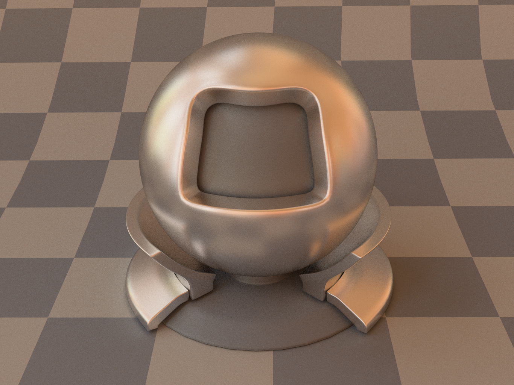
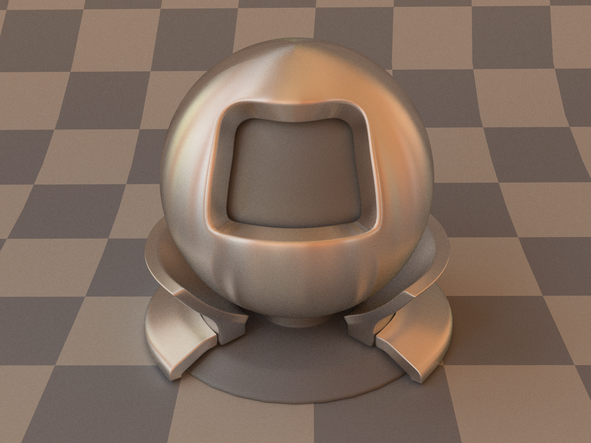
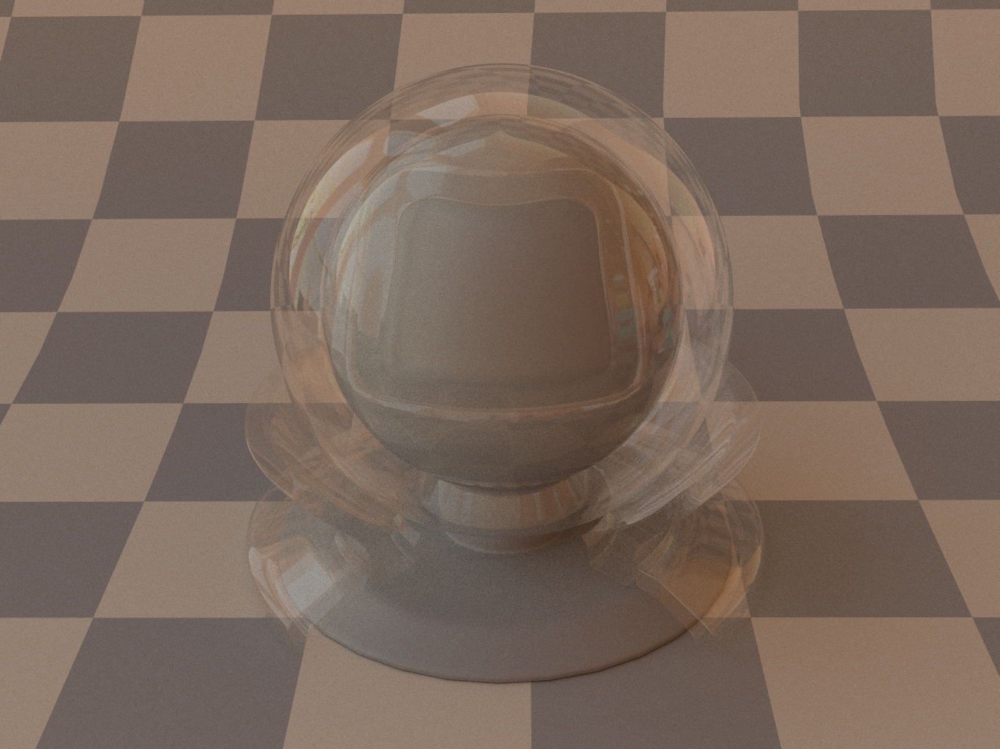
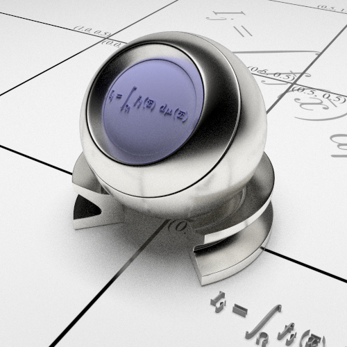

# Monte-Carlo-Path-Tracing

A simple Monte Carlo path tracer based on assignment 7 of GAMES101 originally, accelerated by C++ multithreading or CUDA.

## Gallery

### Cornell Box

### Conductor

### Rough Conductor, Without Energy Compensation

### Isotropic Rough Conductor, Without Energy Compensation

### Dielectric

### Rough Dielectric, Without Energy Compensation

### Isotropic Rough Dielectric, Without Energy Compensation

### Thin Dielectric

### Plastic

### Rough Plastic

### Lte-Orb, Rough Glass, Without Energy Compensation

### Lte-Orb, Silver, Without Energy Compensation

### Dragon

### Box

### Classroom

### Dining Room

