# 蒙特卡洛路径追踪（Monte-Carlo-Path-Tracing）

一个路径追踪小程序，利用了 CPU 多线程或 CUDA 加速计算。项目最初参考了《[GAMES101: 现代计算机图形学入门](https://sites.cs.ucsb.edu/~lingqi/teaching/games101.html)》的作业7，有大幅度的调整。

学习笔记保存于[知乎专栏](https://zhuanlan.zhihu.com/p/459580639)。

A simple Monte Carlo path tracer based on assignment 7 of GAMES101 originally, accelerated by C++ multithreading or CUDA.

## 1 Features

### 1.1 Integrators

- 基于路径追踪（path tracing）算法的[绘制方程定积分迭代求解方法](src/renderer/integrators/path.cpp)，包括：
  - 使用蒙特卡洛方法（Monte Carlo method）计算辐射亮度（radiance）的数学期望；
  - 重要性抽样（importance sampling），给定光线入射方向和表面法线方向，根据 BSDF 对光线出射方向进行重要性抽样；
  - 多重重要性抽样（multiple importance sampling）：
    - 按发光物体表面积直接采样光源；
    - 按 BSDF 采样光源；
  - 俄罗斯轮盘赌算法（Russian roulette）控制路径追踪深度；

### 1.2 表面散射模型（Surface Scattering Models）

- 微表面模型（microfacet model）定义的[电介质（dielectric）材质](src/renderer/bsdfs/dielectric.cpp)，模仿 [mitsuba 相应的材质](https://mitsuba2.readthedocs.io/en/latest/generated/plugins.html#rough-dielectric-material-roughdielectric)；
  - example:
    - [Dielectric](./resources/scene/matpreview/dielectric.xml) 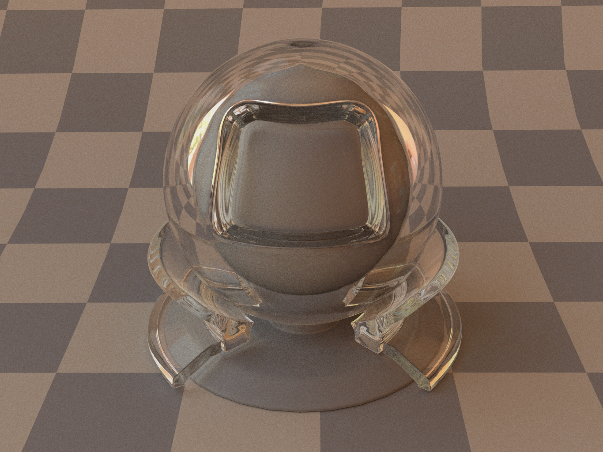
    - [Rough Dielectric](./resources/scene/matpreview/rough_dielectric.xml) 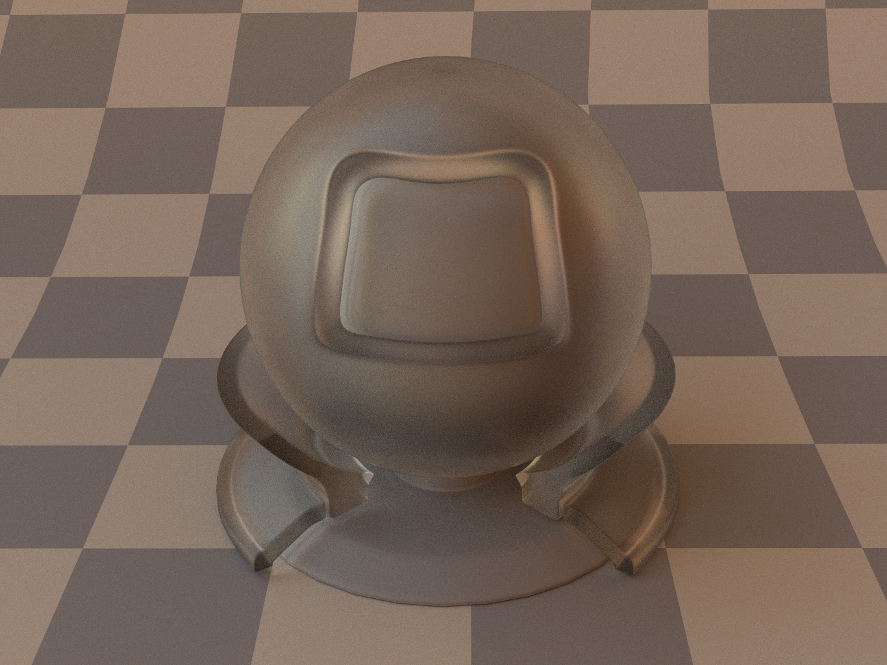
- [薄电介质（thin dielectric）材质](src/renderer/bsdfs/thin_dielectric.cpp)，模仿 [mitsuba 相应的材质](https://mitsuba2.readthedocs.io/en/latest/generated/plugins.html#thin-dielectric-material-thindielectric)；
  - example: [thin Dielectric](./resources/scene/matpreview/thin_dielectric.xml) 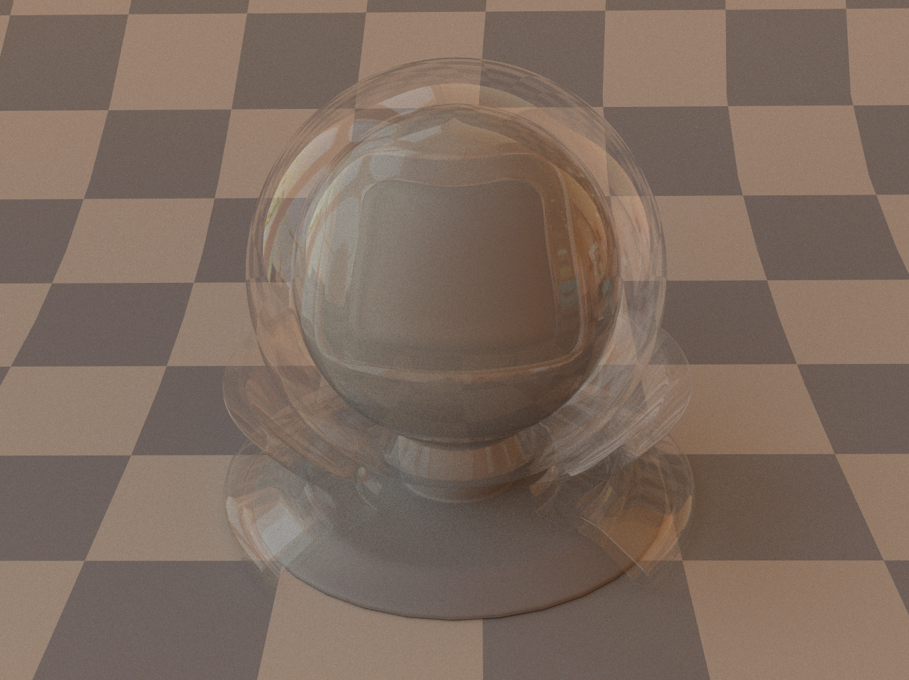
- 微表面模型（microfacet model）定义的[导体（conductor）材质](src/renderer/bsdfs/conductor.cpp)，模仿 [mitsuba 相应的材质](https://mitsuba2.readthedocs.io/en/latest/generated/plugins.html#rough-conductor-material-roughconductor)；
  - example:
    - [Conductor](./resources/scene/matpreview/conductor.xml) 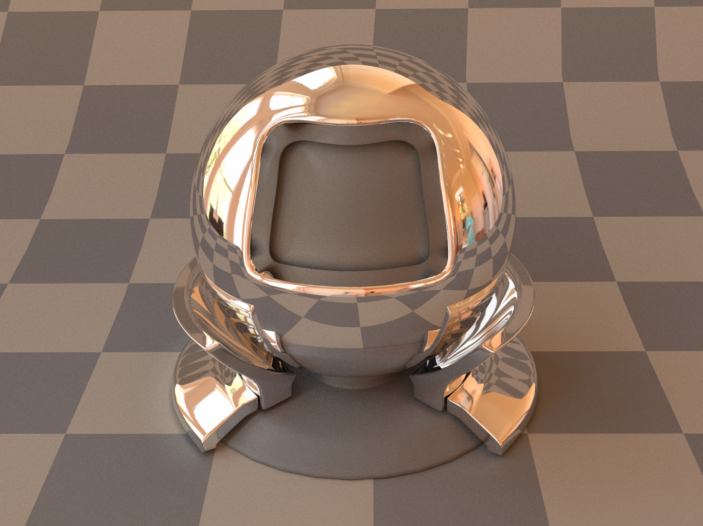
    - [Rough Conductor](./resources/scene/matpreview/rough_conductor.xml) 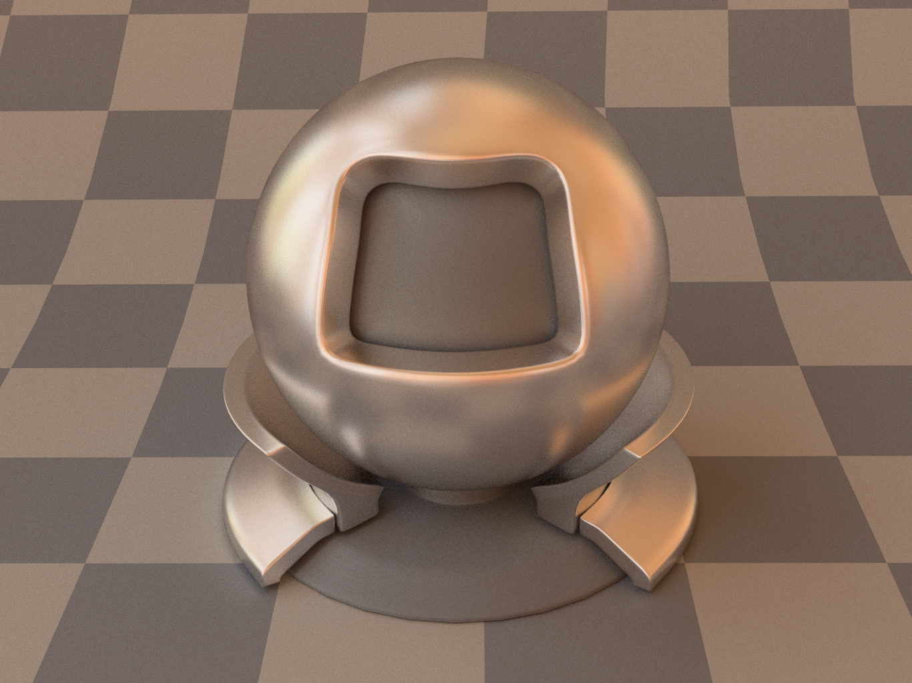
    - [Isotropic Rough Conductor](./resources/scene/matpreview/rough_conductor_isotropic.xml) 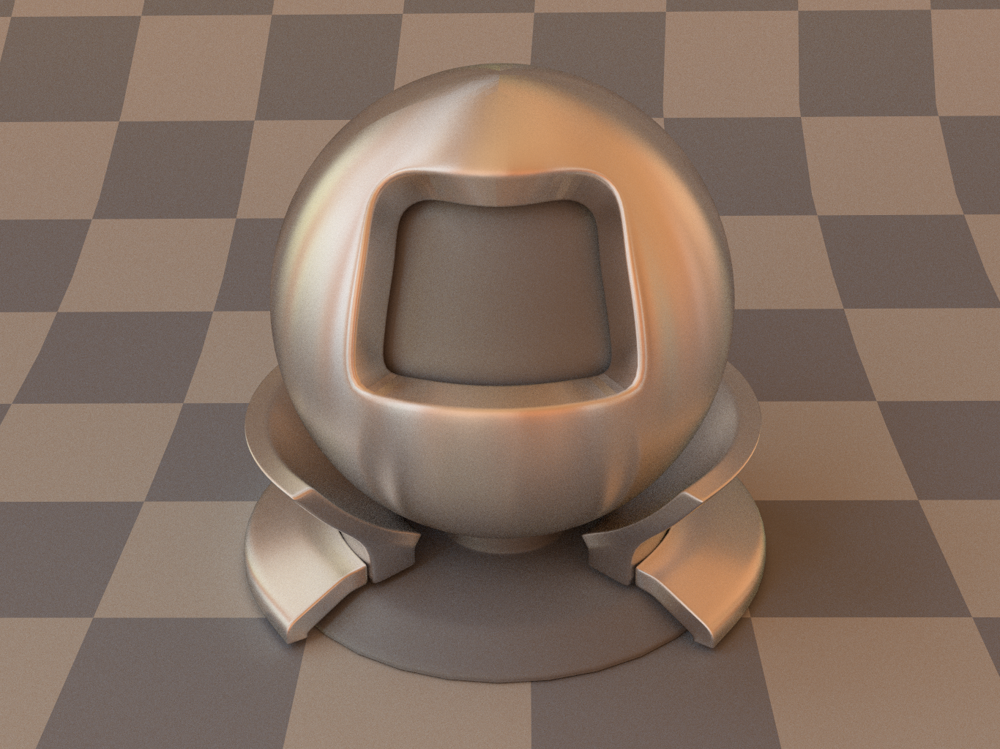
- [塑料（plastic）材质](src/renderer/bsdfs/plastic.cpp)，模仿 [mitsuba 相应的材质](https://mitsuba2.readthedocs.io/en/latest/generated/plugins.html#smooth-plastic-material-plastic)；
  - example:
    - [Plastic](./resources/scene/matpreview/plastic.xml) 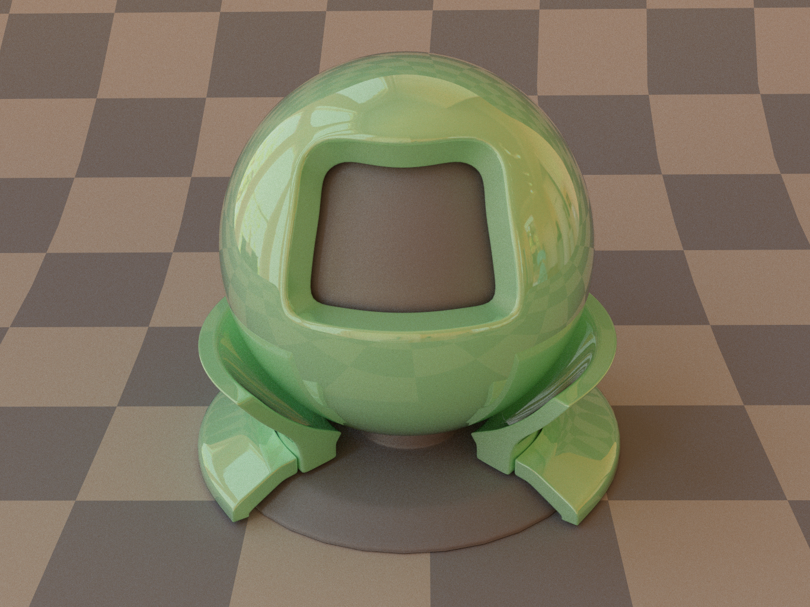
    - [Rough Plastic](./resources/scene/matpreview/rough_plastic.xml) 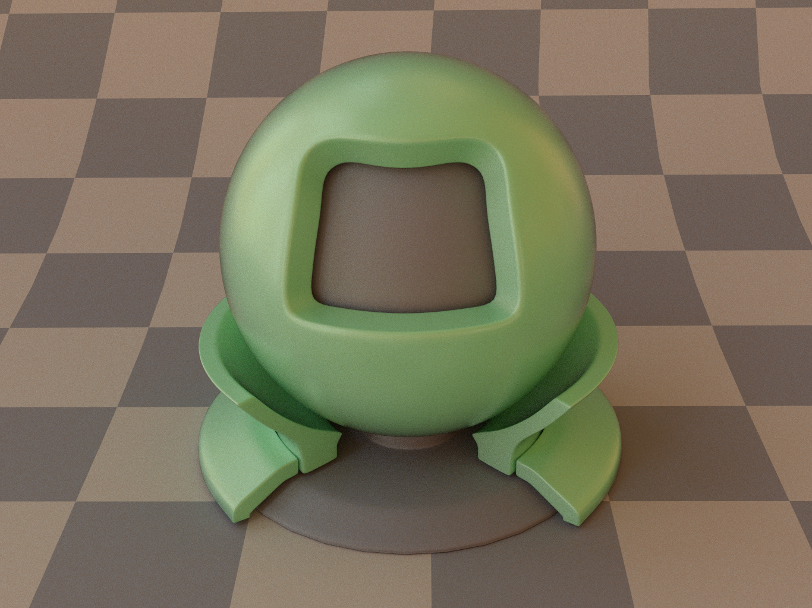
- 朗伯模型（Lambert's model）定义的[平滑漫反射（smooth diffuse）材质](src/renderer/bsdfs/diffuse.cpp)；
  - example: [Dragon](./resources/scene/dragon/scene.xml) 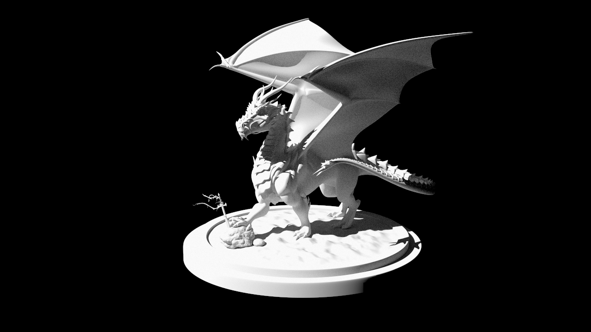
- Oren–Nayar 反射模型（Oren–Nayar reflectance model）定义的[粗糙漫反射（rough diffuse）材质](src/renderer/bsdfs/rough_diffuse.cpp)；
  - example: [mercury, smooth diffuse (Lambert's)](./resources/scene/mercury/smooth_diffuse.xml) VS. [mercury, rough diffuse (Oren–Nayar)](./resources/scene/mercury/rough_diffuse.xml)

### 1.3 参与介质（Participating Media）

- [各向同性相函数（Isotropic Phase Function）](src/renderer/medium/isotropic.cpp)描述的参与介质，模仿 [mitsuba 相应的材质](https://mitsuba2.readthedocs.io/en/latest/generated/plugins.html#isotropic-phase-function-isotropic)；
  - example: [volumetric-caustic](./resources/scene/volumetric-caustic/scene_v0.6.xml) 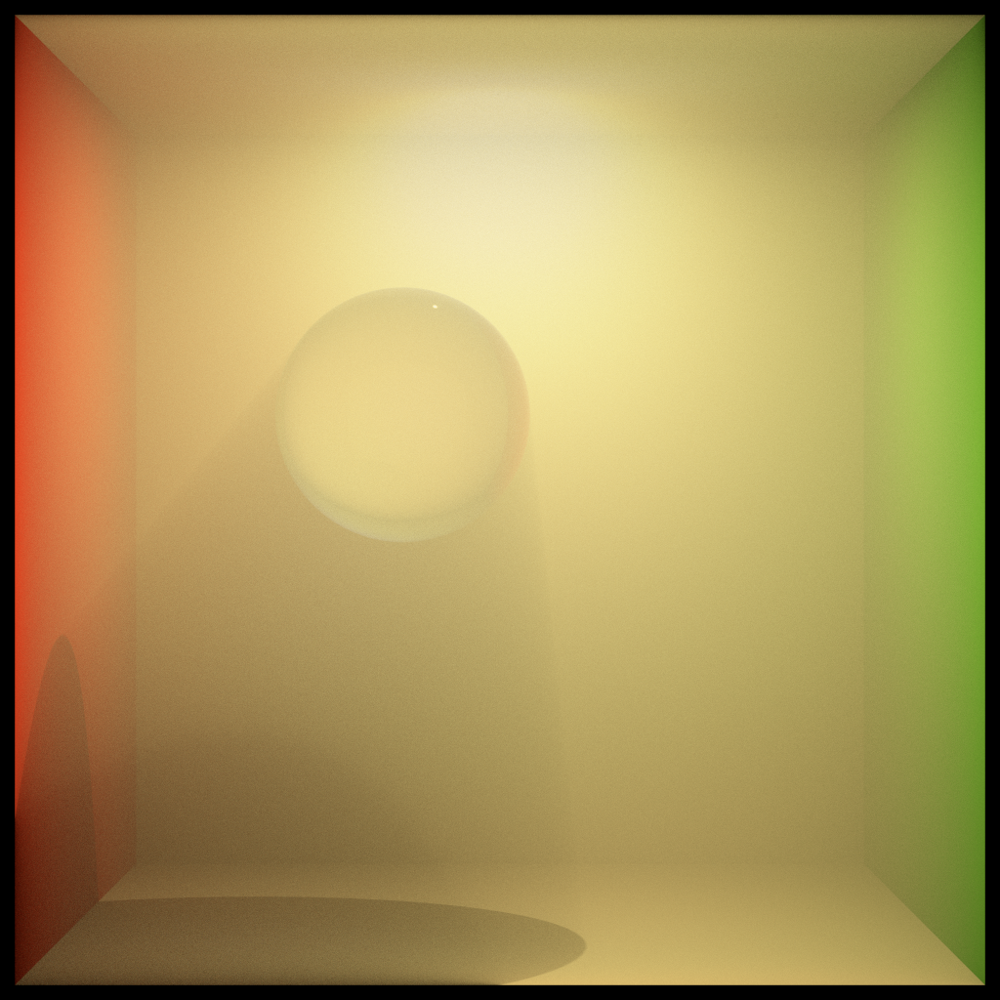
- [亨尼-格林斯坦相函数（Henyey-Greenstein Phase Function）](src/renderer/medium/henyey_greenstein.cpp)描述的参与介质，模仿 [mitsuba 相应的材质](https://mitsuba2.readthedocs.io/en/latest/generated/plugins.html#henyey-greenstein-phase-function-hg)；

### 1.4 其它

- [使用 Kulla 和 Conty 提出的方法](https://fpsunflower.github.io/ckulla/data/s2017_pbs_imageworks_slides_v2.pdf)，尝试补上[微表面模型](https://www.cs.cornell.edu/~srm/publications/EGSR07-btdf.pdf)没有建模的，微表面之间的多重散射；
- 环境映射（environment mapping）
- 凹凸映射（bump mapping）

#### 1.4.1 历史存档项目（Archived）特有的功能

Following features are only available in [`archived` version](archive/).

- [基于双向路径追踪（bidirectional path tracing，BDPT）算法迭代求解绘制方程定积分](archive/src/integrators/bdpt.hpp)；

## 2 Building & Compiling

### 2.1 Dependencies

项目使用 [vcpkg](https://github.com/microsoft/vcpkg) 进行 C++ 库管理。

- necessary:
  - [assimp](https://github.com/assimp/assimp)
  - [pugixml](https://pugixml.org/)
  - [stb](https://github.com/nothings/stb)
  - [tinyexr](https://github.com/syoyo/tinyexr)
  - [zlib](https://zlib.net/)
- if enable real-time viewer:
  - [freeglut](https://freeglut.sourceforge.net/)

automatically import from `extern` folder:

- [ArHosekSkyModel](http://cgg.mff.cuni.cz/projects/SkylightModelling/)
- [stb](http://nothings.org/stb)

### 2.2 CMake Option

- `ENABLE_WATERTIGHT_TRIANGLES`: Specifies whether or not enable Woop's watertight ray/triangle intersection algorithm.
- `ENABLE_CUDA` : Specifies whether or not enable GPU-accelerated computing.
  - compile as C++ project and donnot need CUDA SDK if disable.
- `ENABLE_CUDA_DEBUG` : Specifies whether or not GPU debugging information is generated by the CUDA compiler
  - no effect if disable GPU-accelerated computing.
- `ENABLE_VIEWER` : Specifies whether or not enable real-time viewer.
  - no effect if disable GPU-accelerated computing.

### 2.3 Usage

Command Format: `[-c/--cpu/-g/--gpu/-p/--preview] --input/-i 'config path' [--output/-o 'file path] [--width/-w 'value'] [--height/-h 'value'] [--spp/-s 'value']`

Program Option:

- `--cpu` or `-c`: use CPU for offline rendering.
  - if not specify specify CPU/CUDA/preview, use CPU.
- `--gpu` or `-g`: use CUDA for offline rendering,
  - no effect if disbale CUDA when compiling.
  - if not specify specify CPU/CUDA/preview, use CPU.
- `--preview` or `-p`: use CUDA for real-time rendering,
  - no effect if disbale CUDA when compiling.
  - if not specify specify CPU/CUDA/preview, use CPU.
- `--input` or `-i`: read config from mitsuba format xml file.
- `--output` or `-o`: output path for rendering result.
  - only PNG format, default: 'result.png'.
  - press 's' key to save when real-time previewing.
- `--width` or `-w`: specify the width of rendering picture.
- `--height` or `-h`: specify the height of rendering picture.
- `--spp` or `-s`: specify the number of samples per pixel.

## 3 Gallery

### 3.1 [Cornell Box](./resources/scene/cornell-box/scene_v0.6.xml)

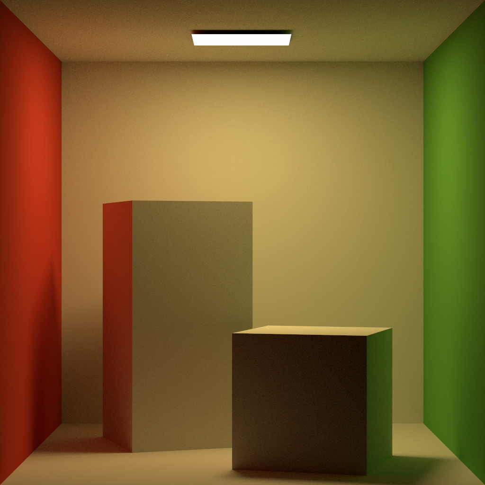

### 3.2 [Box](./resources/scene/scene_v0.6.xml)

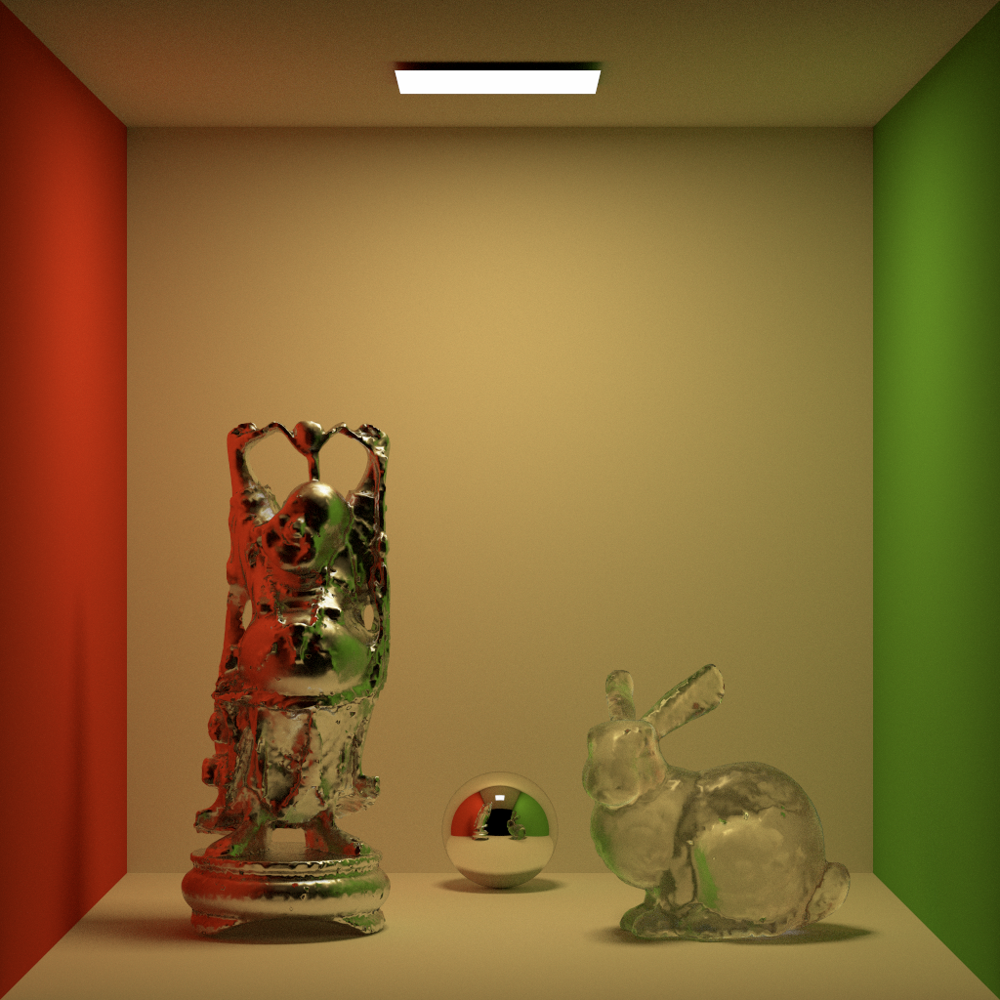

### 3.3 [Lte-Orb, Rough Glass](./resources/scene/lte-orb/rough_glass.xml)

### 3.4 [Lte-Orb, Silver](./resources/scene/lte-orb/silver.xml)

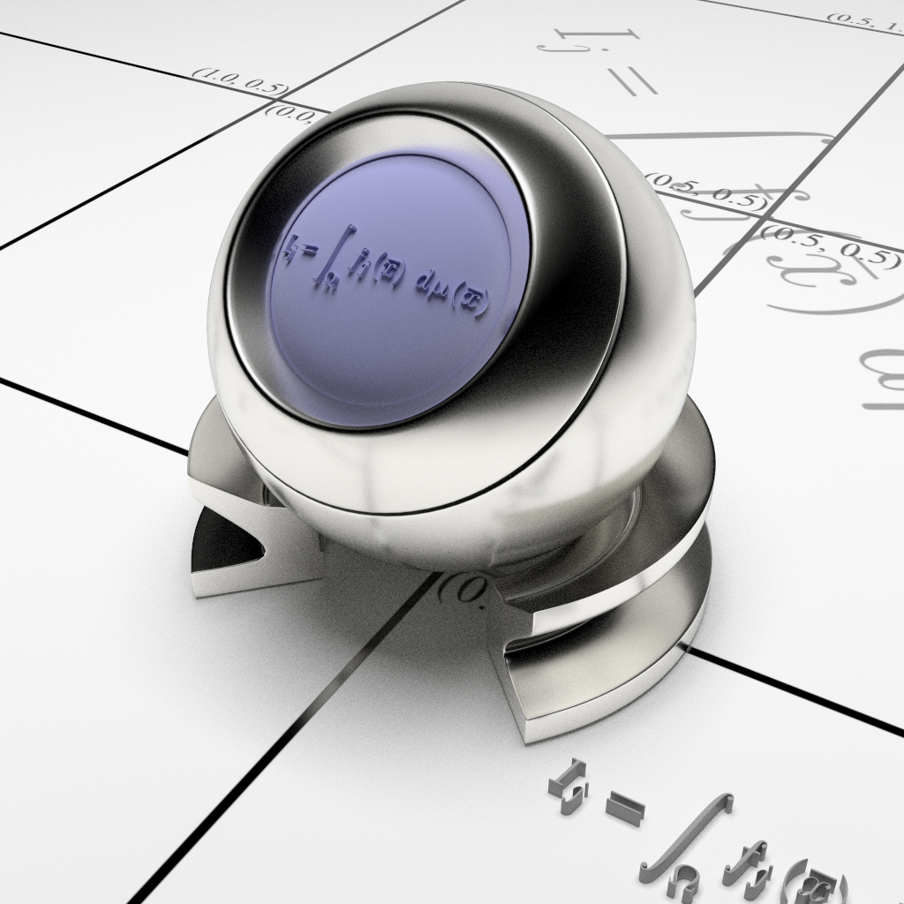

### 3.5 [Dining Room](./resources/scene/dining-room/scene_v0.6.xml)

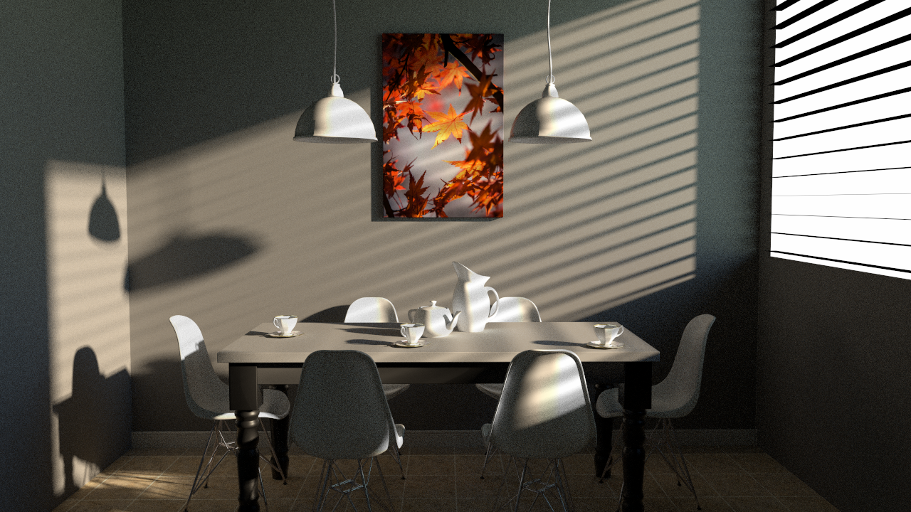

### 3.6 [Classroom](./resources/scene/classroom/scene_v0.6.xml)

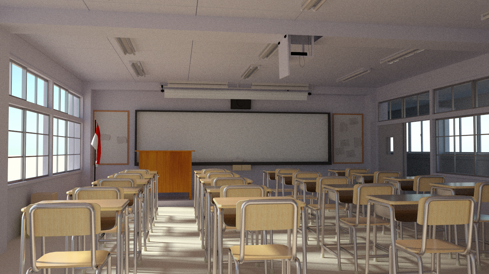

## 4 References

- [Mitsuba renderer](https://github.com/mitsuba-renderer/mitsuba)
- 《[GAMES101: 现代计算机图形学入门](https://sites.cs.ucsb.edu/~lingqi/teaching/games101.html)》
- 《[GAMES202: 高质量实时渲染](https://sites.cs.ucsb.edu/~lingqi/teaching/games202.html)》
- 《[Accelerated Ray Tracing in One Weekend in CUDA](https://developer.nvidia.com/blog/accelerated-ray-tracing-cuda)》
