# 蒙特卡洛路径追踪（Monte Carlo Path Tracing）

一个简单的路径追踪小程序，利用了 OpenMP 和 CUDA 加速计算。

项目最初参考了《[GAMES101: 现代计算机图形学入门](https://sites.cs.ucsb.edu/~lingqi/teaching/games101.html)》的作业7，有大幅度的调整。

[学习记录](https://zhuanlan.zhihu.com/p/459580639)

A simple Monte Carlo path tracer based on assignment 7 of [GAMES101]((https://sites.cs.ucsb.edu/~lingqi/teaching/games101.html)) originally, accelerated by OpenMP and CUDA.

## 1 Features

### 1.1 CUDA 加速计算

测试设备信息：

- 操作系统：Windows 10 21H2
- CPU：AMD Ryzen 7 4800HS
- GPU：NVIDIA RTX 2060 Max-Q

对于[简单的场景](resources/rendering_resources/cornell-box-2/scene.xml)，GPU 加速后计算时间减少到原本的约 13.72%。

- 1024*1024 分辨率，64 spp

| 并发编程 | CPU 多线程加速计算（OpenMP） | GPU 加速计算（CUDA） |
| ------------------------------ | ------------------------------------------------------ | ------------------------------------------------------ |
| 生成图像 | 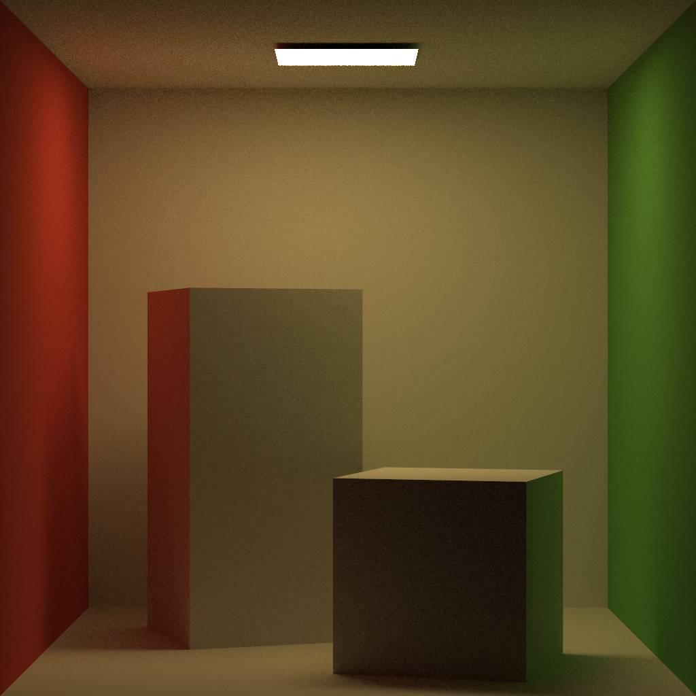 |  |
| 耗时  | 8 min 59 s   | 1 min 14s   |
| 相对速度  | 1   | 7.28   |

对于[相对复杂的场景](resources/rendering_resources/bathroom2/scene.xml)，可能是由于代码实现问题，使用 GPU 加速的效果没有那么好，但仍能节约一定的时间，耗时是原本的约 71.4%。

- 1280*720 分辨率，64 spp

| 并发编程 | CPU 多线程加速计算（OpenMP） | GPU 加速计算（CUDA） |
| ------------------------------ | ------------------------------------------------------ | ------------------------------------------------------ |
| 生成图像 | 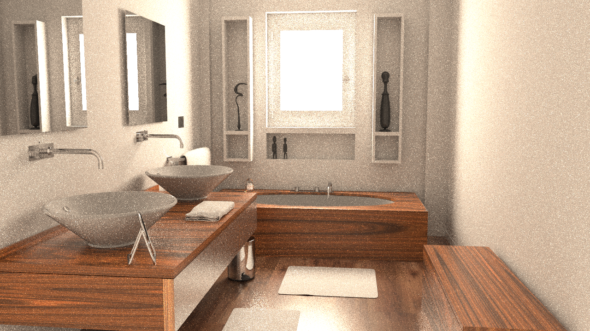 | 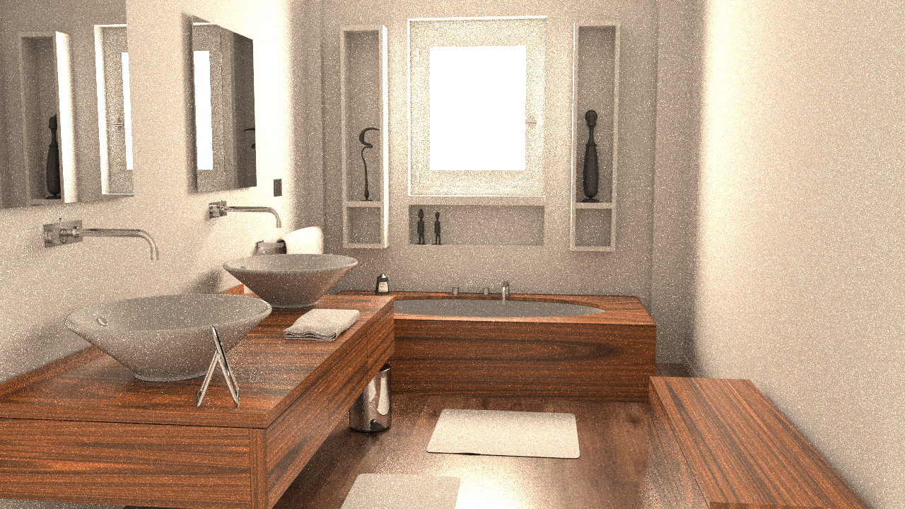 |
| 耗时  | 47 min 10s   | 33 min 42 s   |
| 相对速度 | 1   | 1.4   |

### 1.2 路径跟踪（Path Tracing）和双向路径跟踪（Bidirectional Path Tracing）

| 绘制参数                       | 路径追踪（Path Tracing）                           | 双向路径追踪（Bidirectional Path Tracing）         |
| ------------------------------ | ------------------------------------------------------ | ------------------------------------------------------ |
| 3840*2160 分辨率， 4 spp  |    |    |
| 960*960 分辨率， 64 spp | 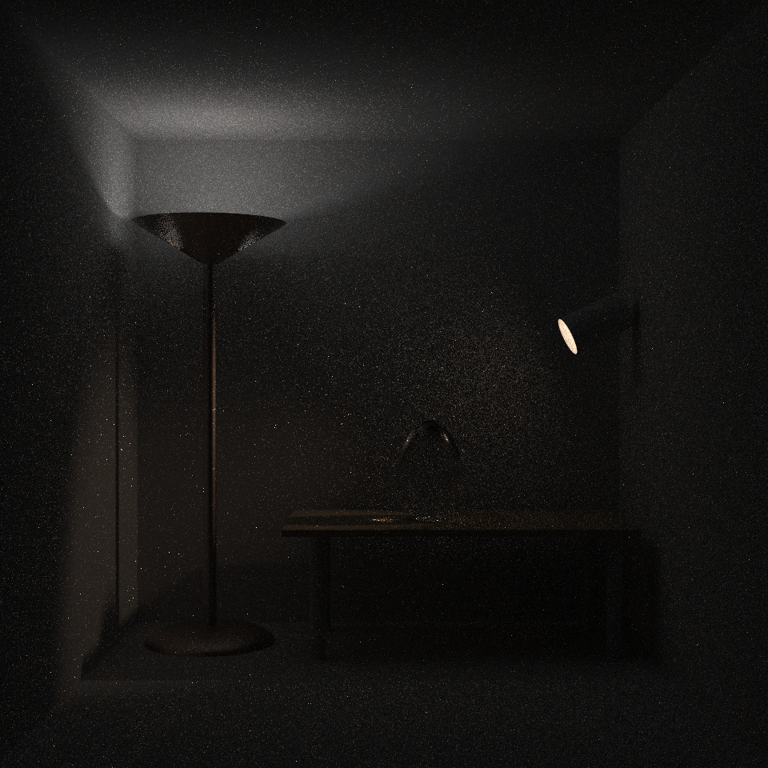 | 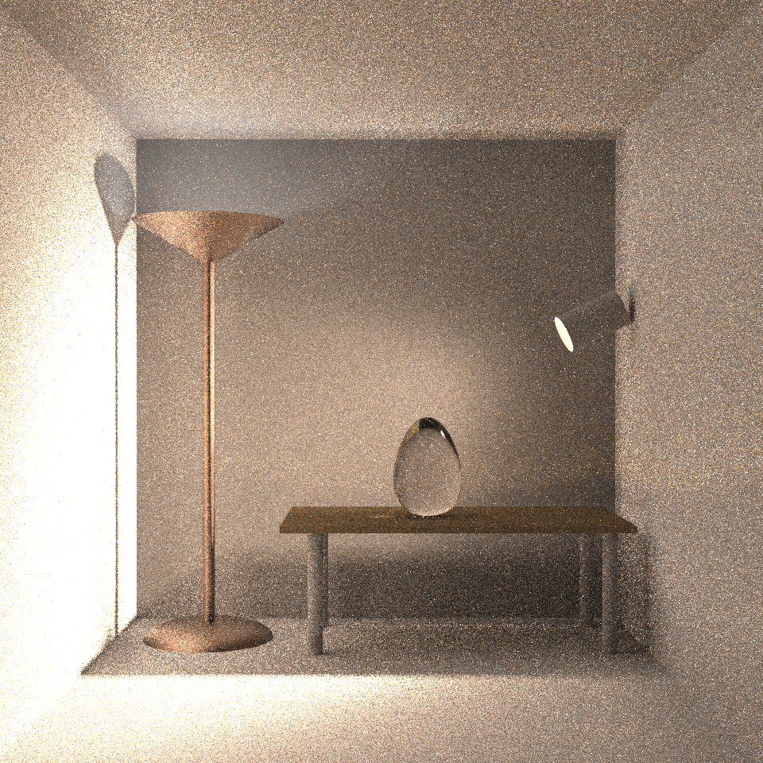 |

### 1.3 表面散射模型（Surface Scattering Models）和参与介质（Multiple Importance Sampling）

左图场景中不存在参与介质，而右图场景中部分区域弥漫着各向同性相函数描述的参与介质。左图绘制参数 [1024*1024 分辨率，64 spp](resources/rendering_resources/veach-caustic/scene_without_participating_media.xml)，右图绘制参数 [1024*1024 分辨率，1024 spp](resources/rendering_resources/veach-caustic/scene.xml)。

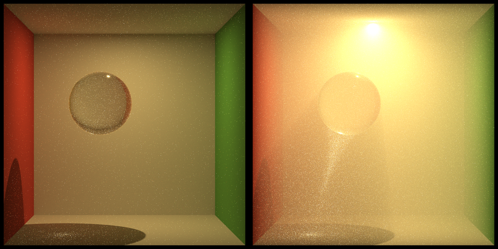

### 1.4 多重重要性抽样（Multiple Importance Sampling）

- [1280*720 分辨率，64 spp](resources/rendering_resources/veach-mis/scene.xml)

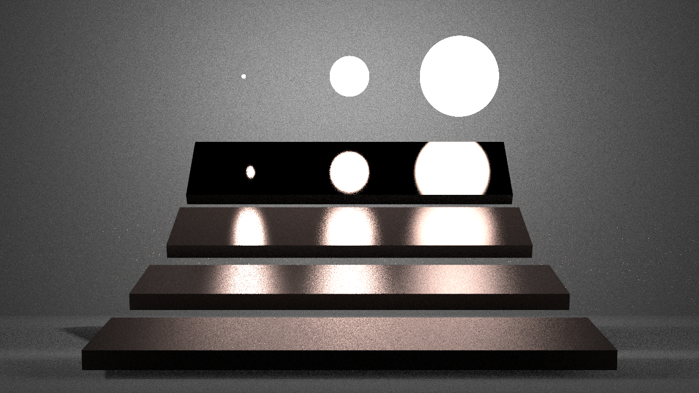

## 2 实现的功能

### 2.1 积分器（Integrators）

- 基于路径追踪（path tracing）算法的[积分器](cpu_version/src/integrators/path.h)，包括：
  - 使用蒙特卡洛方法（Monte Carlo method）计算辐射亮度（radiance）的数学期望；
  - 重要性抽样（importance sampling），给定光线入射方向和表面法线方向，根据 BSDF 对光线出射方向进行重要性抽样；
  - 多重重要性抽样（multiple importance sampling）：
    - 按发光物体表面积直接采样光源；
    - 按 BSDF 采样光源；
  - 俄罗斯轮盘赌（Russian roulette）控制路径追踪深度；
- 基于双向路径追踪（bidirectional path tracing，BDPT）算法的[积分器](cpu_version/src/integrators/bdpt.h)；

### 2.2 表面散射模型（Surface Scattering Models）

- 朗伯模型（Lambert's model）定义的，[平滑的漫反射材质（smooth diffuse material）](cpu_version/src/bsdfs/diffuse.h)；

- 冯模型（Phong model）定义的，[有光泽的材质（glossy material）](cpu_version/src/bsdfs/glossy.h);

- [平滑的电介质材质（smooth dielectric material）](cpu_version/src/bsdfs/dielectric.h)，模仿 [mitsuba 相应的材质](https://mitsuba2.readthedocs.io/en/latest/generated/plugins.html#smooth-dielectric-material-dielectric)；

  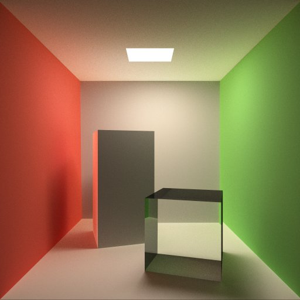

- 微表面模型（microfacet model）定义的，[粗糙的电介质材质（rough dielectric material）](cpu_version/src/bsdfs/rough_dielectric.h)，模仿 [mitsuba 相应的材质](https://mitsuba2.readthedocs.io/en/latest/generated/plugins.html#rough-dielectric-material-roughdielectric)；

  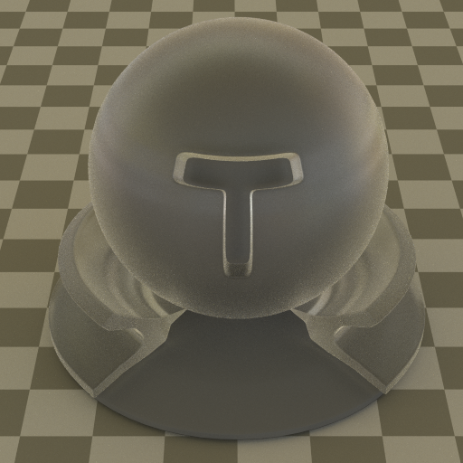

- [薄的电介质材质（thin dielectric material）](cpu_version/src/bsdfs/thin_dielectric.h)，模仿 [mitsuba 相应的材质](https://mitsuba2.readthedocs.io/en/latest/generated/plugins.html#thin-dielectric-material-thindielectric)；

- [平滑的导体材质（smooth conductor material）](cpu_version/src/bsdfs/conductor.h)，模仿 [mitsuba 相应的材质](https://mitsuba2.readthedocs.io/en/latest/generated/plugins.html#smooth-conductor-conductor)；

  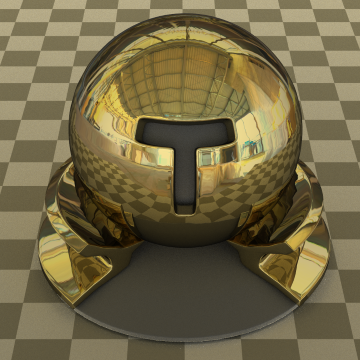

- 微表面模型（microfacet model）定义的，[粗糙的导体材质（rough conductor material）](cpu_version/src/bsdfs/rough_conductor.h)，模仿 [mitsuba 相应的材质](https://mitsuba2.readthedocs.io/en/latest/generated/plugins.html#rough-conductor-material-roughconductor)；

  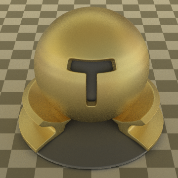

- [平滑的塑料材质（smooth plastic material）](cpu_version/src/bsdfs/plastic.h)，模仿 [mitsuba 相应的材质](https://mitsuba2.readthedocs.io/en/latest/generated/plugins.html#smooth-plastic-material-plastic)；

  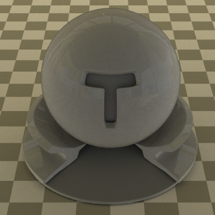

- [粗糙的塑料材质（rough plastic material）](cpu_version/src/bsdfs/rough_plastic.h)，模仿 [mitsuba 相应的材质](https://mitsuba2.readthedocs.io/en/latest/generated/plugins.html#rough-plastic-material-roughplastic)；

  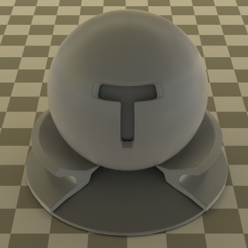

- [粗糙的漫反射材质（rough diffuse material）](cpu_version/src/bsdfs/rough_diffuse.h)，模仿 [mitsuba 相应的材质](https://github.com/mitsuba-renderer/mitsuba/blob/master/src/bsdfs/roughdiffuse.cpp)；

  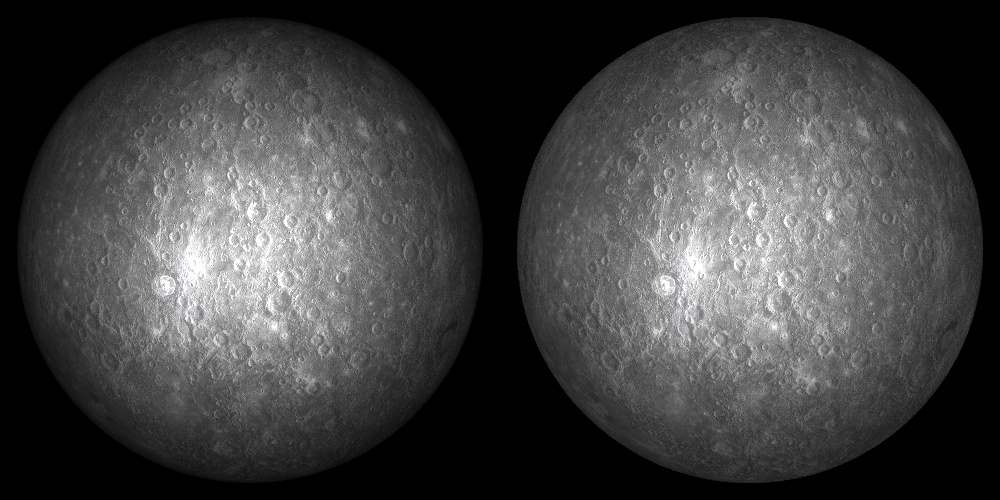

  左图使用朗伯模型描述的平滑的漫反射材质，右图使用 Oren–Nayar reflectance model 描述的粗糙的漫反射材质。可以发现，在接近球体边缘的地方，右图比左图更亮一些。

  [左图配置](resources/rendering_resources/mercury/scene_smooth.xml)，[右图配置](resources/rendering_resources/mercury/scene_rough.xml)。

### 2.3 参与介质（Participating Media）

- [各向同性相函数（Isotropic Phase Function）](cpu_version/src/phase_function/isotropic.h)描述的参与介质，模仿 [mitsuba 相应的材质](https://mitsuba2.readthedocs.io/en/latest/generated/plugins.html#isotropic-phase-function-isotropic)；

  

  左图场景中不存在参与介质，而右图场景中部分区域弥漫着各向同性相函数描述的参与介质。

  [左图配置](resources/rendering_resources/veach-caustic/scene_without_participating_media.xml)， [右图配置](resources/rendering_resources/veach-caustic/scene.xml)。

- [亨尼-格林斯坦相函数（Henyey-Greenstein Phase Function）](cpu_version/src/phase_function/henyey_greenstein.h)描述的参与介质，模仿 [mitsuba 相应的材质](https://mitsuba2.readthedocs.io/en/latest/generated/plugins.html#henyey-greenstein-phase-function-hg)；

### 2.4 其它

- [使用Kulla和Conty提出的方法](https://fpsunflower.github.io/ckulla/data/s2017_pbs_imageworks_slides_v2.pdf)，尝试补上[微表面模型](https://www.cs.cornell.edu/~srm/publications/EGSR07-btdf.pdf)没有建模的，微表面之间的多重散射；

- 环境映射（environment mapping）

- 凹凸映射（bump mapping）

- 内置了一些材质的[折射率（refractive index）](cpu_version/src/core/ior.h#L21)和[消光系数（extinction coefficient）](cpu_version/src/core/ior.h#L196)，在配置文件中可根据名称直接调用

## 3 支持的绘制配置文件格式及使用说明

- mitsuba 0.5 定义的 [xml 格式文件](resources/rendering_resources/bathroom/scene.xml)（部分支持）；
- CPU 版本还支持自拟的 [json 格式文件](resources/rendering_resources/cornell-box/scene.json)；
- 在 Windows 下编译后执行命令：`.\SimpleRenderer.exe render_config.xml [output_path.png]`

## 4 Dependencies

项目使用 [vcpkg](https://github.com/microsoft/vcpkg) 进行 c++ 库管理。

- [nlohmann json](https://github.com/nlohmann/json)

- [RapidXML](http://rapidxml.sourceforge.net/)

- [glm](https://github.com/g-truc/glm)

- [assimp](https://github.com/assimp/assimp)

- [tinyobjloader](https://github.com/tinyobjloader/tinyobjloader)

- [stb](https://github.com/nothings/stb)

- [tinyexr](https://github.com/syoyo/tinyexr)

## 5 References

- 《[GAMES101: 现代计算机图形学入门](https://sites.cs.ucsb.edu/~lingqi/teaching/games101.html)》

- [Mitsuba renderer](https://github.com/mitsuba-renderer/mitsuba)

- 《[Accelerated Ray Tracing in One Weekend in CUDA](https://developer.nvidia.com/blog/accelerated-ray-tracing-cuda)》

- 《[GAMES202: 高质量实时渲染](https://sites.cs.ucsb.edu/~lingqi/teaching/games202.html)》
