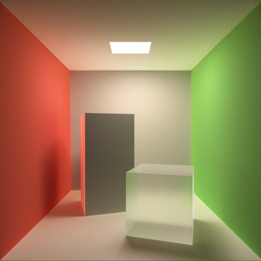
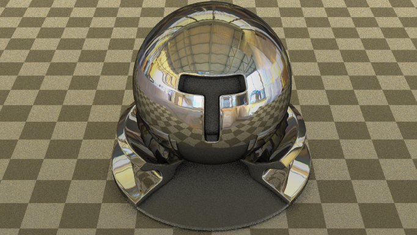
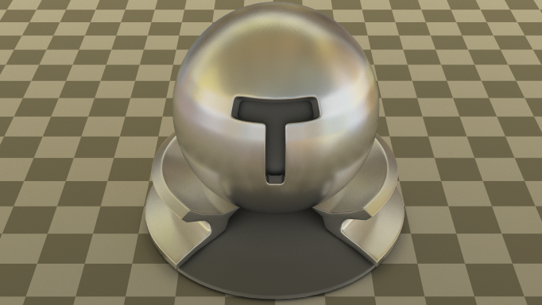
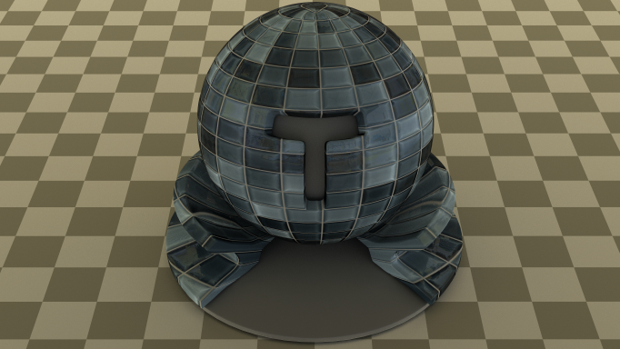
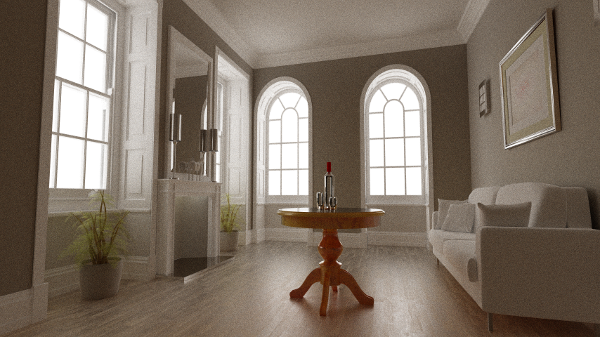
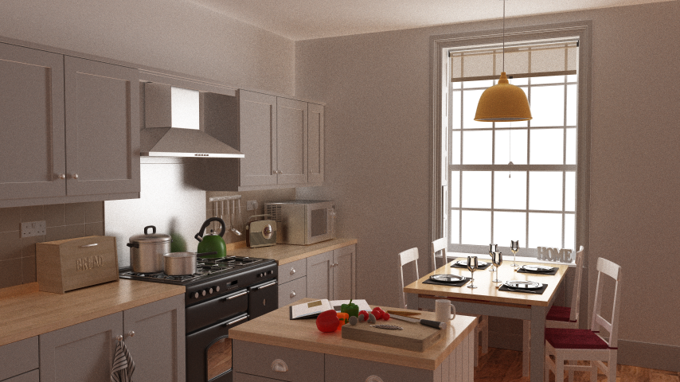

# 蒙特卡洛路径追踪（Monte Carlo Path Tracing）
一个简单的路径追踪小程序，基于《[GAMES101: 现代计算机图形学入门 ](https://sites.cs.ucsb.edu/~lingqi/teaching/games101.html)》的作业7（有大幅度的调整）。

A simple Monte Carlo path tracer based on assignment 7 of [GAMES101]((https://sites.cs.ucsb.edu/~lingqi/teaching/games101.html)).

## 1 支持的绘制配置文件格式

- 自拟的[ json 格式文件](resources/rendering_resources/cornell-box/scene.json)；

- mitsuba 0.5 定义的[ xml 格式文件](resources/rendering_resources/bathroom/scene.xml)（部分支持）；

## 2 实现的功能

### 2.1 表面散射模型（Surface scattering models）

- 朗伯模型（Lambert's model）定义的，[平滑的漫反射材质（smooth diffuse material）](src/material/bsdfs/diffuse.h)；

- 冯模型（Phong model）定义的，[有光泽的材质（glossy material）](src/material/bsdfs/glossy.h);

- [平滑的电介质材质（smooth dielectric material）](src/material/bsdfs/dielectric.h)，模仿[ mitsuba 相应的材质](https://mitsuba2.readthedocs.io/en/latest/generated/plugins.html#smooth-dielectric-material-dielectric)；

  

- 微表面模型（microfacet model）定义的，[粗糙的电介质材质（rough dielectric material）](src/material/bsdfs/rough_dielectric.h)，模仿[ mitsuba 相应的材质](https://mitsuba2.readthedocs.io/en/latest/generated/plugins.html#rough-dielectric-material-roughdielectric)；

  

- [薄的电介质材质（thin dielectric material）](src/material/bsdfs/thin_dielectric.h)，模仿[ mitsuba 相应的材质](https://mitsuba2.readthedocs.io/en/latest/generated/plugins.html#thin-dielectric-material-thindielectric)；

- [平滑的导体材质（smooth conductor material）](src/material/bsdfs/conductor.h)，模仿[ mitsuba 相应的材质](https://mitsuba2.readthedocs.io/en/latest/generated/plugins.html#smooth-conductor-conductor)；

  

- 微表面模型（microfacet model）定义的，[粗糙的导体材质（rough conductor material）](src/material/bsdfs/rough_conductor.h)，模仿[ mitsuba 相应的材质](https://mitsuba2.readthedocs.io/en/latest/generated/plugins.html#rough-conductor-material-roughconductor)；

  

- [平滑的塑料材质（smooth plastic material）](src/material/bsdfs/plastic.h)，模仿[ mitsuba 相应的材质](https://mitsuba2.readthedocs.io/en/latest/generated/plugins.html#smooth-plastic-material-plastic)；

  

- [粗糙的塑料材质（rough plastic material）](src/material/bsdfs/rough_plastic.h)，模仿[ mitsuba 相应的材质](https://mitsuba2.readthedocs.io/en/latest/generated/plugins.html#rough-plastic-material-roughplastic)；（可能存在错误，may contain errors）

### 2.2 积分器（Integrators）

- 基于路径追踪（path tracing）算法的积分器，包括：
  - 使用蒙特卡洛方法（Monte Carlo method）计算辐射亮度（radiance）的数学期望；
  - 重要性抽样（importance sampling），给定光线入射方向和表面法线方向，根据 BSDF 对光线出射方向进行重要性抽样；
  - 多重重要性抽样（multiple importance sampling）：
    - 按发光物体表面积直接采样光源；
    - 按 BSDF 采样光源；（可能存在错误，may contain errors）
  - 俄罗斯轮盘赌（Russian roulette）控制路径追踪深度；

### 2.3 其它

- 环境映射（environment mapping）

- 凹凸映射（bump mapping）

- 内置了一些电介质材质的[折射率（refractive index）](src/rendering/ray.h#L9)，在配置文件中可根据名称直接调用：

    | 名称（Preset(s)）                  | 说明（Description）          | 名称（Preset(s)）                              | 说明（Description）  |
    | ---------------------------------- | ---------------------------- | ---------------------------------------------- | -------------------- |
    | vacuum                             | 真空                         | acetone                                        | 丙酮                 |
    | bromine                            | 溴                           | bk7                                            | BK7玻璃              |
    | helium                             | 氦                           | ethanol                                        | 乙醇                 |
    | water ice water-ice           | 水冰                         | sodium chloride sodium-chloride           | 氯化钠               |
    | hydrogen                           | 氢                           | carbon tetrachloride carbon-tetrachloride | 四氯化碳             |
    | fused quartz fused-quartz     | 熔融石英                     | amber                                          | 琥珀                 |
    | air                                | 空气                         | glycerol                                       | 甘油                 |
    | pyrex                              | 派热克斯玻璃（一种耐热玻璃） | pet                                            | 聚对苯二甲酸乙二醇酯 |
    | carbon dioxide carbon-dioxide | 二氧化碳                     | benzene                                        | 苯                   |
    | acrylic glass acrylic-glass   | 丙烯酸玻璃                   | diamond                                        | 金刚石               |
    | water                              | 水                           | silicone oil silicone-oil                 | 硅油                 |
    | polypropylene                      | 聚丙烯                       |                                                |                      |

- 内置了一些导体材质的[折射率](src/rendering/ray.h#L208)和[消光系数（extinction coefficient）](src/rendering/ray.h#L325)，在配置文件中可根据名称直接调用：

    | 名称（Preset(s)）    | 说明（Description）                   | 名称（Preset(s)）    | 说明（Description）                           |
    | -------------------- | ------------------------------------- | -------------------- | --------------------------------------------- |
    | a-C                  | 无定形碳 Amorphous carbon             | Li Li_palik     | 锂 Lithium                                    |
    | Ag                   | 银 Silver                             | MgO MgO_palik   | 氧化镁 Magnesium oxide                        |
    | Al                   | 铝 Aluminium                          | Mo Mo_palik     | 钼 Molybdenum                                 |
    | Al2O3                | 氧化铝 Aluminium oxide                | Na Na_palik     | 钠 Sodium                                     |
    | AlAs AlAs_palik | 立方砷化铝 Cubic aluminium arsenide   | Nb Nb_palik     | 铌 Niobium                                    |
    | AlSb AlSb_palik | 立方锑化铝 Cubic aluminium antimonide | Ni Ni_palik     | 镍 Nickel                                     |
    | Au                   | 金 Gold                               | Rh Rh_palik     | 铑 Rhodium                                    |
    | Be Be_palik     | 多晶铍 Polycrystalline beryllium      | Se Se_palik     | 硒 Selenium                                   |
    | Cr                   | 铬 Chromium                           | SiC SiC_palik   | 六方碳化硅 Hexagonal silicon carbide          |
    | CsI CsI_palik   | 立方碘化铯 Cubic caesium iodide       | SnTe SnTe_palik | 碲化锡 Tin telluride                          |
    | Cu Cu_palik     | 铜 Copper                             | Ta Ta_palik     | 钽 Tantalum                                   |
    | Cu2O Cu2O_palik | 氧化亚铜 Cuprous oxide                | Te Te_palik     | 三方碲 Trigonal tellurium                     |
    | CuO CuO_palik   | 氧化铜 Cupric oxide                   | ThF4 ThF4_palik | 多晶四氟化钍 Polycryst. thorium tetrafluoride |
    | d-C d-C_palik   | 立方金刚石 Cubic diamond              | TiC TiC_palik   | 多晶碳化钛 Polycrystalline titanium carbide   |
    | Fe                   | 铁 Iron                               | TiN TiN_palik   | 氮化钛 Titanium nitride                       |
    | GaN                  | 氮化镓 Gallium nitride                | TiO2 TiO2_palik | 四方二氧化钛 Tetragonal titanium dioxide      |
    | Ge                   | 锗 Germanium                          | VC VC_palik     | 碳化钒 Vanadium carbide                       |
    | Hg Hg_palik     | 汞 Mercury                            | V V_palik       | 钒 Vanadium                                   |
    | HgTe HgTe_palik | 碲化汞 Mercury telluride              | VN VN_palik     | 氮化钒 Vanadium nitride                       |
    | Ir Ir_palik     | 铱 Iridium                            | W                    | 钨 Tungsten                                   |
    | K K_palik       | 多晶钾 Polycrystalline potassium      | none                 | 全反射镜面 100% reflecting mirror             |

## 3 更多的绘制效果

- 《[Contemporary Bathroom](http://www.blendswap.com/blends/view/75302)》 by [Mareck](http://www.blendswap.com/users/view/Mareck)，来源于[Rendering Resources | Benedikt Bitterli's Portfolio ](https://benedikt-bitterli.me/resources/)；
  
  - 以16K，9 spp 绘制；

  

- 《[The Grey & White Room](http://www.blendswap.com/blends/view/75795)》 by [Wig42](http://www.blendswap.com/users/view/Wig42)，来源于[Rendering Resources | Benedikt Bitterli's Portfolio ](https://benedikt-bitterli.me/resources/)；

  - 以16K，9 spp 绘制；

  

- 《[Country Kitchen](http://www.blendswap.com/blends/view/42851)》 by [Jay-Artist](http://www.blendswap.com/user/Jay-Artist)，来源于[Rendering Resources | Benedikt Bitterli's Portfolio ](https://benedikt-bitterli.me/resources/)；

  - 以16K，4 spp 绘制；

  

## 4 依赖（Dependencies）

建议使用 [vcpkg](https://github.com/microsoft/vcpkg) 进行 c++ 库管理。

- [nlohmann json](https://github.com/nlohmann/json)

- [RapidXML](http://rapidxml.sourceforge.net/)

- [glm](https://github.com/g-truc/glm)

- [assimp](https://github.com/assimp/assimp)

- [tinyobjloader](https://github.com/tinyobjloader/tinyobjloader)

- [stb](https://github.com/nothings/stb)

- [tinyexr](https://github.com/syoyo/tinyexr)

## 5 参考

- 《[GAMES101: 现代计算机图形学入门 ](https://sites.cs.ucsb.edu/~lingqi/teaching/games101.html)》

- [Mitsuba renderer](https://github.com/mitsuba-renderer/mitsuba)

  

