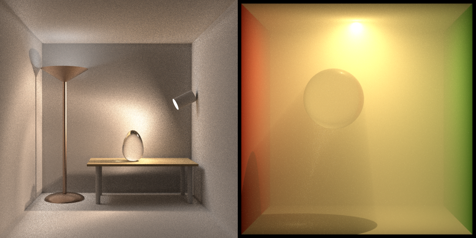

# 蒙特卡洛路径追踪（Monte Carlo Path Tracing）

一个路径追踪小程序，利用了 CPU 多线程加速计算。项目最初参考了《[GAMES101: 现代计算机图形学入门](https://sites.cs.ucsb.edu/~lingqi/teaching/games101.html)》的作业7，有大幅度的调整。[学习记录（知乎系列文章）](https://zhuanlan.zhihu.com/p/459580639)。

A Monte Carlo path tracer based on assignment 7 of [GAMES101](https://sites.cs.ucsb.edu/~lingqi/teaching/games101.html) originally, accelerated by C++ multithreading.

## 2 实现的功能

### 2.1 积分器（Integrators）

- 基于路径追踪（path tracing）算法的[绘制方程定积分迭代求解方法](src/integrators/path.hpp)，包括：
  - 使用蒙特卡洛方法（Monte Carlo method）计算辐射亮度（radiance）的数学期望；
  - 重要性抽样（importance sampling），给定光线入射方向和表面法线方向，根据 BSDF 对光线出射方向进行重要性抽样；
  - 多重重要性抽样（multiple importance sampling）：
    - 按发光物体表面积直接采样光源；
    - 按 BSDF 采样光源；
  - 俄罗斯轮盘赌（Russian roulette）控制路径追踪深度；
- 基于双向路径追踪（bidirectional path tracing，BDPT）算法的[绘制方程定积分迭代求解方法](src/integrators/bdpt.hpp)；

### 2.2 表面散射模型（Surface Scattering Models）

- 朗伯模型（Lambert's model）定义的，[平滑的漫反射材质（smooth diffuse material）](src/bsdfs/diffuse.hpp)；

- [平滑的电介质材质（smooth dielectric material）](src/bsdfs/dielectric.hpp)，模仿 [mitsuba 相应的材质](https://mitsuba2.readthedocs.io/en/latest/generated/plugins.html#smooth-dielectric-material-dielectric)；

- 微表面模型（microfacet model）定义的、[粗糙的电介质材质（rough dielectric material）](src/bsdfs/rough_dielectric.hpp)，模仿 [mitsuba 相应的材质](https://mitsuba2.readthedocs.io/en/latest/generated/plugins.html#rough-dielectric-material-roughdielectric)；

- [薄的电介质材质（thin dielectric material）](src/bsdfs/thin_dielectric.hpp)，模仿 [mitsuba 相应的材质](https://mitsuba2.readthedocs.io/en/latest/generated/plugins.html#thin-dielectric-material-thindielectric)；

- [平滑的导体材质（smooth conductor material）](src/bsdfs/conductor.hpp)，模仿 [mitsuba 相应的材质](https://mitsuba2.readthedocs.io/en/latest/generated/plugins.html#smooth-conductor-conductor)；

- 微表面模型（microfacet model）定义的、[粗糙的导体材质（rough conductor material）](src/bsdfs/rough_conductor.hpp)，模仿 [mitsuba 相应的材质](https://mitsuba2.readthedocs.io/en/latest/generated/plugins.html#rough-conductor-material-roughconductor)；

- [平滑的塑料材质（smooth plastic material）](src/bsdfs/plastic.hpp)，模仿 [mitsuba 相应的材质](https://mitsuba2.readthedocs.io/en/latest/generated/plugins.html#smooth-plastic-material-plastic)；

- [粗糙的塑料材质（rough plastic material）](src/bsdfs/rough_plastic.hpp)，模仿 [mitsuba 相应的材质](https://mitsuba2.readthedocs.io/en/latest/generated/plugins.html#rough-plastic-material-roughplastic)；

### 2.3 参与介质（Participating Media）

- [各向同性相函数（Isotropic Phase Function）](src/phase_function/isotropic.hpp)描述的参与介质，模仿 [mitsuba 相应的材质](https://mitsuba2.readthedocs.io/en/latest/generated/plugins.html#isotropic-phase-function-isotropic)；

- [亨尼-格林斯坦相函数（Henyey-Greenstein Phase Function）](src/phase_function/henyey_greenstein.hpp)描述的参与介质，模仿 [mitsuba 相应的材质](https://mitsuba2.readthedocs.io/en/latest/generated/plugins.html#henyey-greenstein-phase-function-hg)；

### 2.4 其它

- [使用 Kulla 和 Conty 提出的方法](https://fpsunflower.github.io/ckulla/data/s2017_pbs_imageworks_slides_v2.pdf)，尝试补上[微表面模型](https://www.cs.cornell.edu/~srm/publications/EGSR07-btdf.pdf)没有建模的，微表面之间的多重散射；

- 环境映射（environment mapping）

- 凹凸映射（bump mapping）

## 支持的绘制配置文件格式及使用说明

- mitsuba 定义的 xml 格式文件（部分支持）；
- 在 Windows 下编译后执行命令：`.\RayTracer.exe render_config.xml [output_path.png]`

## Dependencies

项目使用 [vcpkg](https://github.com/microsoft/vcpkg) 进行 C++ 库管理。

- [pugixml](https://pugixml.org/)

- [glm](https://github.com/g-truc/glm)

- [assimp](https://github.com/assimp/assimp)

- [stb](https://github.com/nothings/stb)

- [tinyexr](https://github.com/syoyo/tinyexr)

- [zlib](https://zlib.net/)

## 5 References

- [Mitsuba renderer](https://github.com/mitsuba-renderer/mitsuba)

- 《[GAMES101: 现代计算机图形学入门](https://sites.cs.ucsb.edu/~lingqi/teaching/games101.html)》

- 《[GAMES202: 高质量实时渲染](https://sites.cs.ucsb.edu/~lingqi/teaching/games202.html)》

- 《[Accelerated Ray Tracing in One Weekend in CUDA](https://developer.nvidia.com/blog/accelerated-ray-tracing-cuda)》
